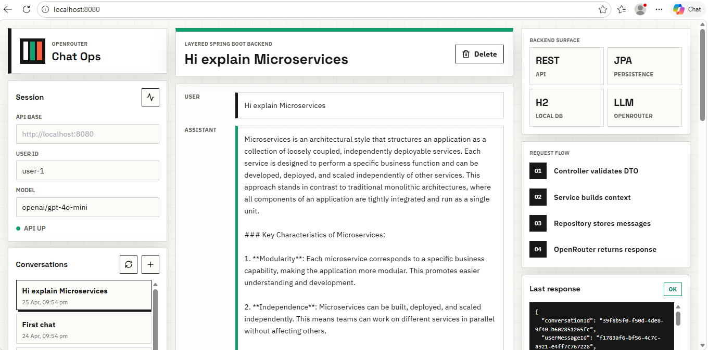
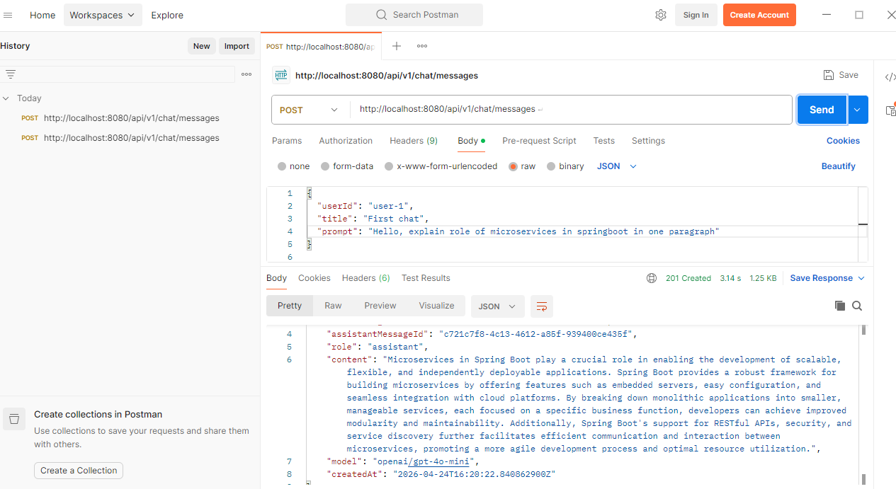

# Spring Boot AI Chat Backend

Production-style backend for a ChatGPT-like chat system built with Java 21, Spring Boot, JPA, H2, and the OpenRouter LLM API.

Repository: [https://github.com/imrajeevnayan/springboot-ai-chat-backend.git](https://github.com/imrajeevnayan/springboot-ai-chat-backend.git)

## Screenshots

### Chat UI



### Postman API Response



## Why This Project Matters

This project demonstrates backend engineering skills that are directly useful in real-world AI products:

- Clean layered architecture with Controller, Service, Repository, DTO, and provider-client boundaries
- OpenRouter integration using a dedicated client with timeout, retry, and provider error handling
- Persistent conversation history with users, conversations, and messages
- Stateless REST APIs suitable for frontend, mobile app, or external client integration
- H2 local database setup for quick testing without external infrastructure
- Input validation, centralized error handling, and rate limiting
- Scalable design decisions documented for moving from local development to production

## Tech Stack

| Area | Technology |
| --- | --- |
| Language | Java 21 |
| Framework | Spring Boot 3.x |
| API | Spring Web REST |
| Persistence | Spring Data JPA, Hibernate |
| Local Database | H2 file-backed database |
| AI Provider | OpenRouter Chat Completions API |
| Build Tool | Maven |
| Testing | JUnit 5, Spring Boot Test, MockMvc |
| Monitoring | Spring Boot Actuator |

## Architecture Overview

```text
Client / Postman
      |
      v
ChatController
      |
      v
ChatService
      |
      +--> RateLimitService
      |
      +--> UserRepository / ConversationRepository / MessageRepository
      |
      +--> OpenRouterClient
                |
                v
          OpenRouter API
```

### Layer Responsibilities

- `controller`: REST endpoints, request validation, HTTP status handling
- `service`: business flow, conversation context, rate limiting, persistence orchestration
- `repository`: database access using Spring Data JPA
- `domain`: JPA entities for users, conversations, and messages
- `dto`: API request and response models
- `openrouter`: external AI provider integration
- `exception`: centralized error mapping and clean JSON error responses
- `config`: app configuration, WebClient setup, request path normalization

## Core Features

- Send prompts and receive AI responses
- Create new conversations automatically
- Continue existing conversations using `conversationId`
- Store full chat history per user
- List conversations with pagination
- List messages for a conversation
- Delete conversations safely by user ownership
- Use H2 database locally with persistent file storage
- Handle invalid input with validation errors
- Handle OpenRouter API failures using structured backend errors
- Normalize accidental trailing encoded whitespace in URLs from Postman

## Scalability And Backend Design Highlights

This backend is intentionally structured so it can grow beyond a local demo.

- Stateless API design: requests carry `userId`, making the app easier to scale horizontally.
- Provider isolation: OpenRouter logic is contained in `OpenRouterClient`, so another LLM provider can be added without rewriting controllers.
- Bounded context window: only recent messages are sent to the model to control latency, cost, and token usage.
- DTO pattern: API contracts are separated from database entities.
- Repository abstraction: persistence can move from H2 to PostgreSQL or MySQL with minimal business-layer changes.
- Central error handling: clients receive consistent JSON error responses.
- Config-driven behavior: model, rate limit, timeouts, and provider settings are environment configurable.
- Test profile isolation: tests use in-memory H2 and do not conflict with the running local file database.

## Reliability Features

- OpenRouter request timeout
- Retry support for transient provider/network failures
- Provider rate-limit handling
- Empty or malformed provider response handling
- Local per-user request rate limiting
- Central `RestExceptionHandler`
- Spring Boot Actuator health endpoint

## Security-Aware Choices

- API key is read from environment variables, not stored in code or database.
- Request body validation protects prompt size and required fields.
- Conversation access checks combine `conversationId` and `userId` to avoid accidental cross-user access.
- SQL injection risk is reduced by using Spring Data JPA parameter binding.
- `.gitignore` excludes local database files and build output.

## Database Model

```text
users
  id
  external_user_id
  display_name
  created_at
  updated_at

conversations
  id
  user_id
  title
  created_at
  updated_at

messages
  id
  conversation_id
  role
  content
  model
  created_at
```

Relationships:

- One user has many conversations.
- One conversation has many messages.
- Messages are ordered by `created_at`.

Indexes:

- `users.external_user_id`
- `conversations(user_id, updated_at)`
- `messages(conversation_id, created_at)`

## Prerequisites

Install:

- Java 21
- Maven 3.9+
- Postman
- OpenRouter API key

Verify Java:

```powershell
java -version
```

Verify Maven:

```powershell
mvn -version
```

## Configure OpenRouter API Key

For the current PowerShell window:

```powershell
$env:OPENROUTER_API_KEY="your_openrouter_api_key_here"
```

Permanent Windows setup:

```powershell
setx OPENROUTER_API_KEY "your_openrouter_api_key_here"
```

After using `setx`, close PowerShell and open a new terminal.

The API key is used only by the backend to call OpenRouter. It is not stored in H2.

## Run The Application

From the project root:

```powershell
mvn spring-boot:run
```

Application URL:

```text
http://localhost:8080
```

Health check:

```text
GET http://localhost:8080/actuator/health
```

Expected response:

```json
{
  "status": "UP"
}
```

## Run With Docker

Build the image:

```powershell
docker build -t springboot-ai-chat-backend .
```

Run the container:

```powershell
docker run --rm -p 8080:8080 `
  -e OPENROUTER_API_KEY="your_openrouter_api_key_here" `
  -v ${PWD}/data:/app/data `
  springboot-ai-chat-backend
```

Open:

```text
http://localhost:8080
```

## H2 Database

The default local profile uses file-backed H2:

```text
jdbc:h2:file:./data/chat_backend
```

This keeps local chat history after app restarts.

H2 console:

```text
http://localhost:8080/h2-console
```

Connection values:

```text
JDBC URL: jdbc:h2:file:./data/chat_backend
User Name: sa
Password:
```

Leave password empty.

Useful SQL:

```sql
SELECT * FROM users;
SELECT * FROM conversations;
SELECT * FROM messages;
```

## API Endpoints

| Method | Endpoint | Description |
| --- | --- | --- |
| `POST` | `/api/v1/chat/messages` | Send prompt and receive AI response |
| `GET` | `/api/v1/users/{userId}/conversations` | List conversations for a user |
| `GET` | `/api/v1/conversations/{conversationId}/messages?userId={userId}` | List messages in a conversation |
| `DELETE` | `/api/v1/conversations/{conversationId}?userId={userId}` | Delete a conversation |
| `GET` | `/actuator/health` | Service health check |

## Test With Postman

### 1. Health Check

```text
Method: GET
URL: http://localhost:8080/actuator/health
```

### 2. Send First Chat Message

```text
Method: POST
URL: http://localhost:8080/api/v1/chat/messages
```

Headers:

```text
Content-Type: application/json
```

Body:

```json
{
  "userId": "user-1",
  "title": "First chat",
  "prompt": "Hello, explain Spring Boot in one paragraph"
}
```

Expected response:

```json
{
  "conversationId": "uuid",
  "userMessageId": "uuid",
  "assistantMessageId": "uuid",
  "role": "assistant",
  "content": "AI response text",
  "model": "openai/gpt-4o-mini",
  "createdAt": "timestamp"
}
```

### 3. Continue Same Conversation

Copy `conversationId` from the first response.

```json
{
  "userId": "user-1",
  "conversationId": "paste-conversation-id-here",
  "prompt": "Now explain it with a small Java example"
}
```

### 4. List Conversations

```text
GET http://localhost:8080/api/v1/users/user-1/conversations?page=0&size=20
```

### 5. List Messages

```text
GET http://localhost:8080/api/v1/conversations/{conversationId}/messages?userId=user-1&page=0&size=50
```

### 6. Delete Conversation

```text
DELETE http://localhost:8080/api/v1/conversations/{conversationId}?userId=user-1
```

Expected status:

```text
204 No Content
```

## Configuration

Main config:

```text
src/main/resources/application.yml
```

Local H2 config:

```text
src/main/resources/application-local.yml
```

Optional PostgreSQL config:

```text
src/main/resources/application-postgres.yml
```

Environment variables:

| Variable | Purpose | Default |
| --- | --- | --- |
| `OPENROUTER_API_KEY` | OpenRouter API key | empty |
| `OPENROUTER_MODEL` | Default model | `openai/gpt-4o-mini` |
| `SERVER_PORT` | App port | `8080` |
| `CHAT_REQUESTS_PER_MINUTE` | Per-user local rate limit | `30` |
| `CHAT_PROMPT_MAX_LENGTH` | Maximum prompt length | `12000` |

## Run Tests

```powershell
mvn clean test
```

Expected:

```text
BUILD SUCCESS
```

Tests run against in-memory H2 using the `test` profile.

## Project Structure

```text
src/main/java/com/example/chatbackend
  config          Configuration, WebClient setup, URL normalization
  controller      REST controllers
  domain          JPA entities and enums
  dto             Request and response DTOs
  exception       Custom exceptions and global error handler
  openrouter      OpenRouter client and provider DTOs
  repository      Spring Data JPA repositories
  service         Business logic, chat flow, rate limiting
```

## Troubleshooting

### OpenRouter API key is not configured

Set the key and restart the app:

```powershell
$env:OPENROUTER_API_KEY="your_openrouter_api_key_here"
mvn spring-boot:run
```

### API route not found

Use the exact URL:

```text
http://localhost:8080/api/v1/chat/messages
```

Avoid trailing spaces or newlines in Postman.

### H2 database already in use

Stop any existing Spring Boot process using the database, then restart:

```powershell
mvn spring-boot:run
```

### Port 8080 already in use

Run on another port:

```powershell
$env:SERVER_PORT="8081"
mvn spring-boot:run
```

Use:

```text
http://localhost:8081
```

## Production Upgrade Path

This project is local-development ready with H2. For production, upgrade these areas:

- Replace H2 with PostgreSQL or MySQL.
- Add Flyway or Liquibase database migrations.
- Add Spring Security with JWT or OAuth2.
- Replace in-memory rate limiting with Redis or API gateway throttling.
- Add structured logging and distributed tracing.
- Add Docker and CI/CD pipeline.
- Add streaming responses for long AI completions.
- Add token counting and conversation summarization.

## What This Project Demonstrates

- Java backend development with Spring Boot
- REST API design and DTO modeling
- JPA entity design and relationship mapping
- External API integration with WebClient
- AI provider integration patterns
- Error handling and resilience
- Local database setup with H2
- Testable layered architecture
- Scalability-aware backend design
